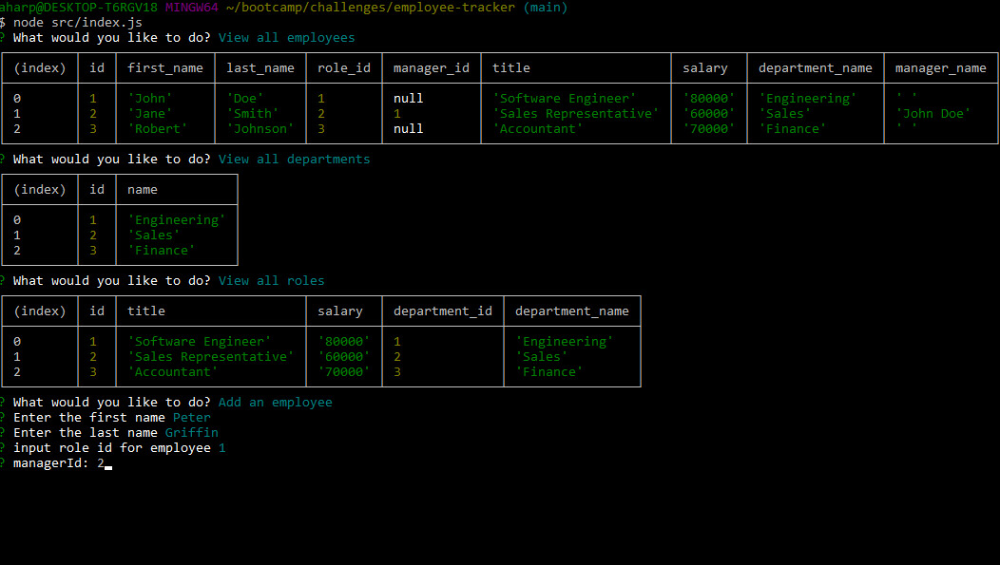

# EMPLOYEE TRACKER

## Intro
The Employee Tracker is an application that executes inside of the terminal. Starting with a sample database, users have options to view roles, departments, and employees. There are also options to add departments, add employees, add roles, and update roles.

## Installation 
- Clone this repository
- Open the directory in the terminal
- run the following commands:
- `npm init -y`
- `psql -U postgres`
- `\i db/schema.sql`
- `\i db/seeds.sql`
- `\q` to quit postgres
- `node src/index.js`

The last step will begin launch the application.

## Live URLs
[Tutorial Video](https://drive.google.com/file/d/1YmWwz7ek6Ry6wmiNLTEXVvfaOKl-Z4iO/view?usp=sharing) \
[Github Repo](https://github.com/aharper2568/employee-tracker)

## Screenshots

## Author

Developed in VSCode by  **Anthony Harper**